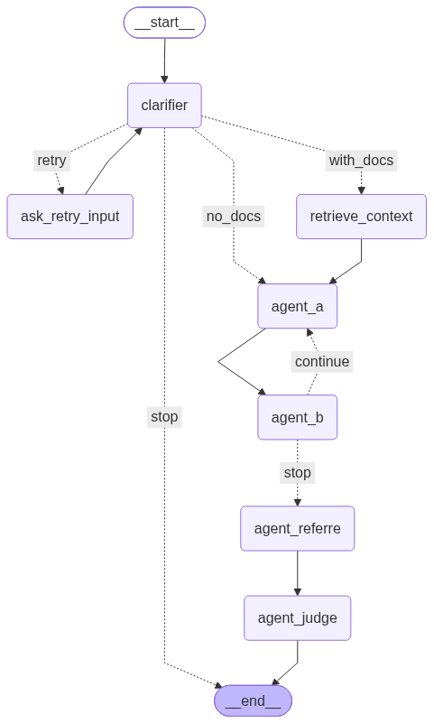

<p align="center">
	
</p>

<h2 align="center">BeyondWhole</h2>

# MAD Chatbot


MAD Chatbot, short for Multi Agent Debate Chatbot, is a Django web application for structured AI debates. A
clarifier validates the topic, two agents argue opposing positions, a referee
summarizes both cases, and a judge selects a winner. Users can optionally
upload documents for RAG-based context and review their debate history.


## Contents

- [Technology stack](#technology-stack)
- [Debate flow](#debate-flow)
- [Local setup](#local-setup)
- [URL map](#url-map)
- [Production deployment](#production-deployment)
- [Project structure](#project-structure)
- [License](#license)

## Technology stack

- Django
- LangGraph
- Google Gemini and Groq
- Tavily search
- FAISS-based document retrieval

## Debate flow

The application validates the user topic, coordinates opposing AI agents,
provides document-grounded context when available, and produces a referee
summary followed by a final judge verdict.



## Local setup

### 1. Create the environment

```bash
python -m venv myenv
source myenv/bin/activate
pip install -r requirements.txt
```

### 2. Configure API keys

Create a `.env` file in the project root with the API keys used by the agents:

```env
Gemini_init_agent_a_key=...
GEMINI_API_KEY_565_agent_b=...
Gemini_Electronic_Referree_key=...
GROQ_API_KEY_electronic_clar=...
GROQ_API_KEY_init_judge=...
TAVILY_API_KEY=...
```

Do not commit real credentials to source control.

### 3. Initialize the database

```bash
python manage.py migrate
```

### 4. Start the development server

```bash
python manage.py runserver
```

Open <http://127.0.0.1:8000/> and create an account to start a debate.

## URL map

| Purpose | URL |
| --- | --- |
| Public landing page | `/` |
| Login | `/login/` |
| Signup | `/signup/` |
| Logout | `/logout/` |
| Authenticated debate workspace | `/home/` |
| Debate stream endpoint | `/stream/` |
| Document upload endpoint | `/upload/` |
| Debate history endpoint | `/history-data/` |
| Debate detail endpoint | `/history/<thread_id>/` |
| Django administration | `/admin/` |

The root path `/` is the single canonical landing-page URL.


### Prepare the deployment

Run these commands during deployment:

```bash
python manage.py migrate
python manage.py collectstatic --noinput
python manage.py check --deploy
```

### Start the application

Serve Django with an ASGI- or WSGI-capable production server behind HTTPS. For
example, an ASGI host can run:

```bash
uvicorn Debate_Project.asgi:application --host 0.0.0.0 --port $PORT
```

Bind the server to `0.0.0.0` for the hosting platform, but users should visit
the configured domain, not `http://0.0.0.0:8000`.

## Project structure

- `graph.py` - main LangGraph debate workflow
- `nodes/` - clarifier, agents, referee, and judge nodes
- `rag/` - document ingestion and retrieval
- `Debate_app/` - Django application, views, models, URLs, and templates
- `Debate_Project/` - Django project configuration and deployment entrypoints
- `static/` - application CSS, JavaScript, and images
- `prompts/` - prompts used by the debate agents

## License

This project is licensed under the [Apache License 2.0](LICENSE).
