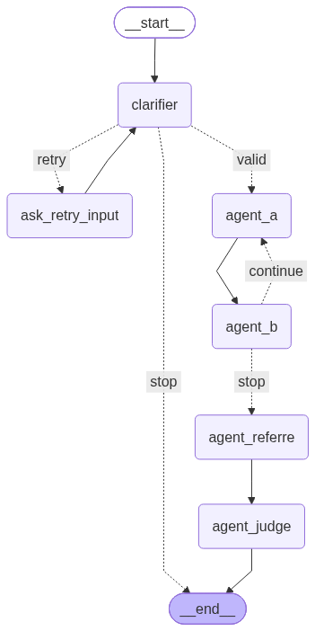

# Multi Agent Debate System

A compact LangGraph-based multi-agent debate app that validates a user input, runs two opposing AI agents, summarizes both sides, and lets a judge decide the winner.


## Overview

This project combines:
- LangGraph for orchestration
- Groq for the clarifier and judge
- Google Gemini for the debate agents and referee
- Tavily search for external evidence
- RAG for local document-based context retrieval

## Flow

  with rag - 

## How it works

1. The clarifier checks whether the user input is meaningful and whether it is factual or opinion-based.
2. If invalid, it asks the user to retry.
3. If RAG is enabled, relevant document chunks are retrieved from the vector store.
4. Agent A argues for the topic and Agent B argues against it.
5. A referee summarizes both sides.
6. A judge evaluates the summaries and returns the final answer and winner.

## Project structure

```text
debate_system/
├── graph.py
├── main.py
├── requirements.txt
├── .env
├── nodes/
│   ├── clar.py
│   ├── agent_a.py
│   ├── agent_b.py
│   ├── agent_referre.py
│   ├── agent_judge.py
│   └── retrieve_context.py
├── rag/
│   ├── ingest.py
│   └── store.py
├── state/
│   └── state.py
├── tools/
│   └── tools.py
├── README.md
└── README2.md
```

## RAG update

The project now includes a retrieval layer:
- document loading and chunking in `rag/ingest.py`
- vector store setup in `rag/store.py`
- contextual retrieval in `nodes/retrieve_context.py`
- optional enabling in `main.py` with `use_rag = True`

This adds document-grounded context before the debate begins.

## Setup

```bash
python -m venv myenv
source myenv/bin/activate
pip install -r requirements.txt
python main.py
```

Add your API keys in `.env` before running.

## Notes

- `main.py` includes a sample input and runs the graph once.
- The debate loop is short and fixed.
- The app depends on external AI/search services, so valid API keys are required.
- RAG is optional and can be turned on/off via the `use_rag` flag.

## Summary

This is a lightweight debate engine built with LangGraph that simulates an AI-vs-AI argument, optionally grounds it in local documents with RAG, summarizes both positions, and lets a judge decide the outcome.
